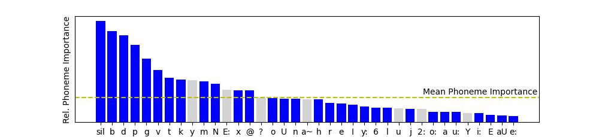

# Phoneme Interpretability

We analyse the gradients on the audio-signal (obtained by backpropagating the averaged LSE-D), to try and observe segments that have the most effect towards affecting averaged LSE-D.
We collect all those segments and observe the phonemes that are spoken during them in order to obtain the importance of each phoneme for AV-sync computation. We observe that SyncNet follows human heuristics, paying close attention to *silences, bilabial* and *labio-dental* phonemes.



### Usage
> Need to modify according to your data-directory location and structure
```
python run_for_phoneme_grads.py
python phoneme_importance.py
```
